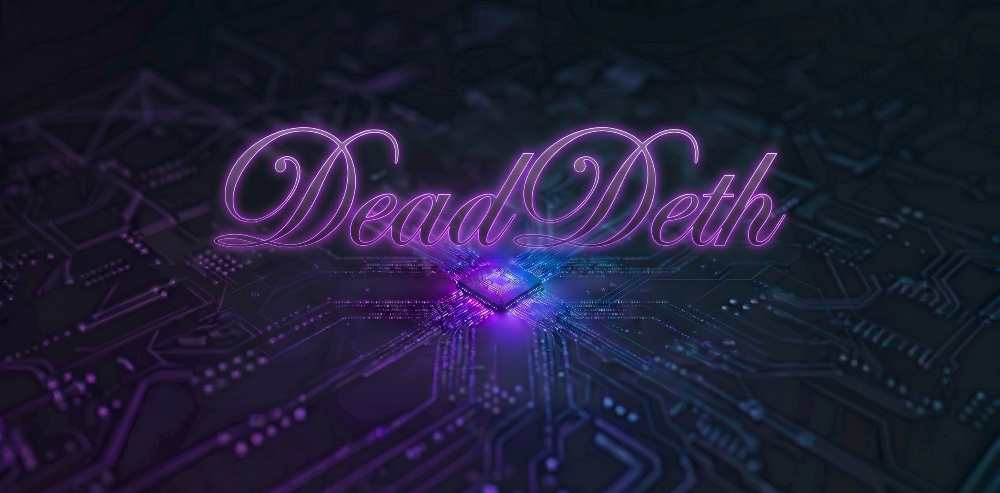

    

>## ***Yo, I`m DeadDeth***
> I've benn blessed with ADHD and coding gives me peace, I just hope it will last.
> I hope some people my find inspirtation in my work, and maybe i will find some in finishing my projects rather than starting a next one, also why not have everything in one place, sounds cool :D

> I will mostly (probbly only) make projects in c/cpp, heard you can call it orthodox c or c with classes, I hate python, hate bloated softs and funcionts,
> I'm running Fedora Workstation 43, and I'm Polish, currently a Studnet, we will see for about how long <3

    
    

